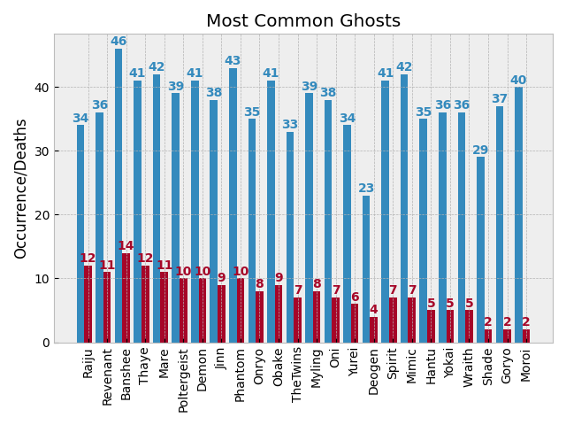
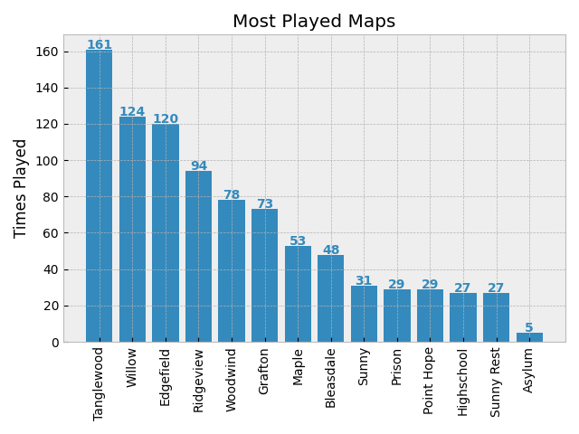
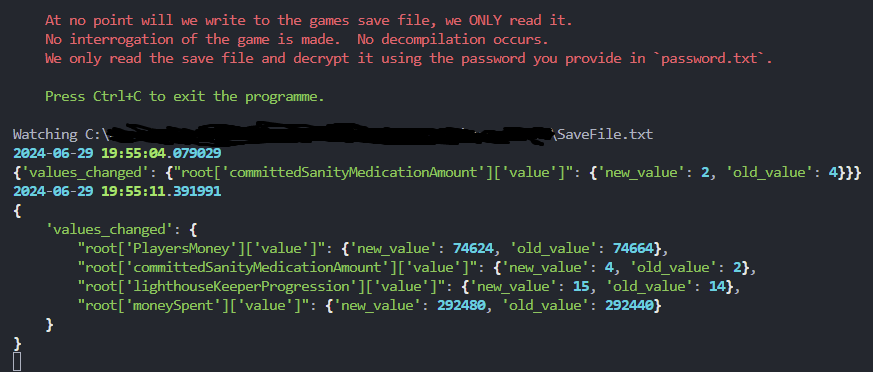

# Python Package to Display Stats from an EC3 Save File

> [!NOTE]
> Windows Defender will probably throw a fit.  This is because the exe is not signed, which can only be done by paying Microsoft for a certificate, which is against the spirit of free software.  You can either ignore the warning or build the exe yourself.

> [!CAUTION]
> Backup your save file.  If the game writes when this module is trying to read then irrecoverable file corruption can occur.

> [!TIP]
> You will need to obtain a password in order to decrypt the save file. No functionality is provided to edit the save file, this is a fancy viewer only.

## Running the program

Download the latest exe file from [the releases page](https://github.com/howroyd/statsaphobia/releases/latest).

Place two files adjacent to wherever you choose to run the exe from.  The files are:

- `path.txt` - A text file containing the path to the save file.  For example, `C:\Users\Me\AppData\LocalLow\My Game\SaveFile.txt`
- `password.txt` - A text file containing the password to decrypt the save file.  This is game specific, you will have to obtain this yourself.

Run the exe!

## Outputs

The program will output a number of graphs to a new `graphs` folder.  These include:




We also output the decoded and decrypted data into respective folders, along with an html file that can be opened in a browser to view the data in a more human readable format.

Save file backups are also created in the `backups` folder when the programme starts and on any file change in the save file directory.

The console also in realtime when a change is detected in the save file:



## Building from source

To build the exe run:

```shell
python build.py
```
